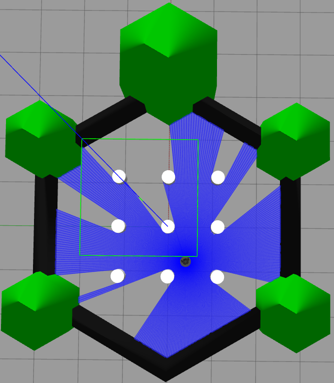
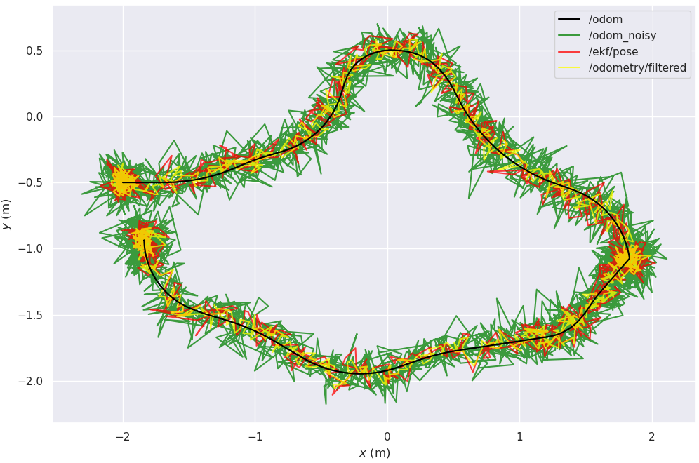
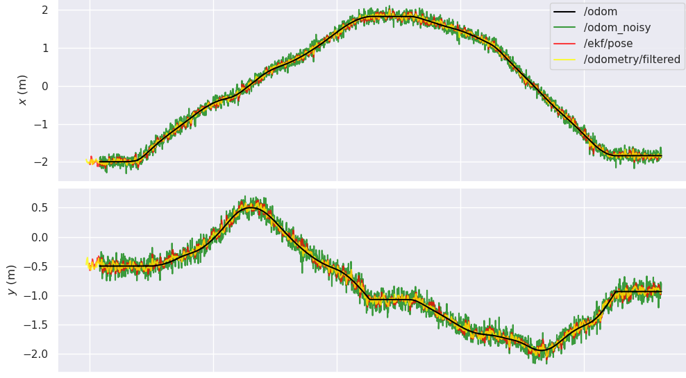
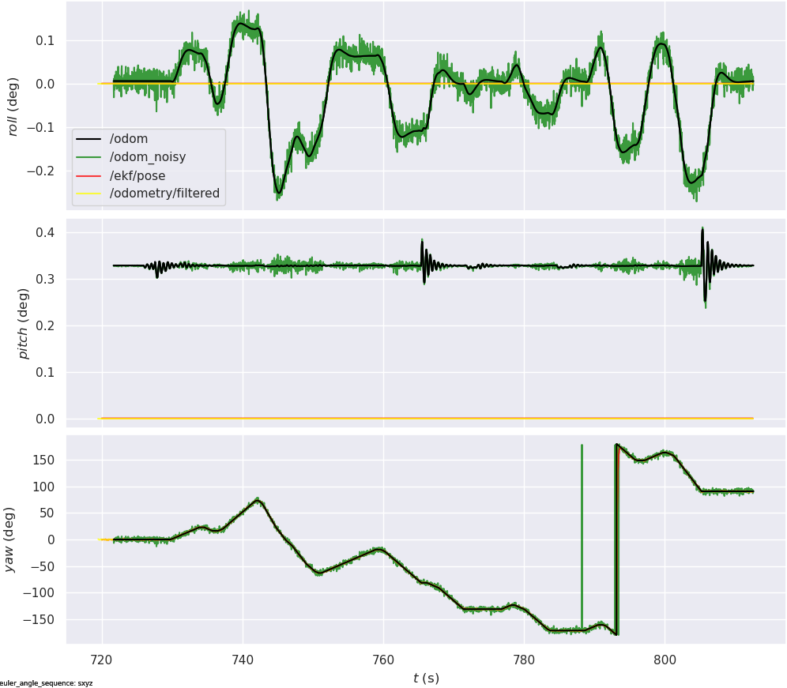

# ROS 2 EKF Localization

I implemented an **Extended Kalman Filter (EKF) from scratch** for 2D TurtleBot3 localization using ROS 2 and Gazebo. The goal was to take noisy odometry and IMU measurements and estimate a more accurate robot trajectory.

## Implementation

I simulated a TurtleBot3 Burger in Gazebo and drove it around the environment using ROS 2. Gazebo provides the robot's odometry through `/odom` and IMU measurements through `/imu`.



To simulate imperfect sensors, I created a ROS 2 wrapper that adds Gaussian noise to the Gazebo measurements. The wrapper takes `/odom` and `/imu` and publishes the corrupted measurements as `/odom_noisy` and `/imu_noisy`.

I then implemented the EKF using a 2D state:

`[x, y, θ]`

The prediction step uses the robot's linear and angular velocity with a nonlinear velocity motion model. The correction step fuses the noisy odometry position `(x, y)` with IMU yaw `θ`. The final estimate is published as `/ekf/pose`.

For comparison, I also ran the same noisy sensor data through the ROS 2 `robot_localization` EKF.

```text
Gazebo TurtleBot3
   │
   ├── /odom ──┐
   └── /imu  ──┤
               ▼
        Noise Wrapper
         │          │
  /odom_noisy   /imu_noisy
         │          │
         └────┬─────┘
              ▼
          Custom EKF
              │
          /ekf/pose
```

## Results

I recorded the trajectories using ROS bags and evaluated them using Absolute Pose Error (APE) with `evo`.

| Method | Translation RMSE |
|---|---:|
| Noisy Odometry | 0.1412 m |
| **Custom EKF** | **0.0903 m** |
| `robot_localization` | 0.0669 m |

The custom EKF reduced the translational RMSE from **14.1 cm to 9.0 cm**, an improvement of approximately **36%** over the noisy odometry.

### Trajectory Comparison



**Black:** reference odometry · **Green:** noisy odometry · **Red:** custom EKF · **Yellow:** `robot_localization`

The noisy odometry has visible variation around the reference path, especially during turns. The custom EKF removes much of this noise and stays closer to the reference trajectory. The `robot_localization` estimate is smoother and achieved the lowest overall RMSE.

### Position Comparison



The noisy `x` and `y` measurements fluctuate around the reference position throughout the run. After filtering, the custom EKF follows the overall position much more closely while removing a large amount of the measurement noise.

### Orientation Comparison



Since the EKF estimates planar motion, yaw is the orientation component I focused on. The filtered yaw follows the robot's orientation while reducing the noise introduced into the IMU measurements.

## Final Results

The project gave me a complete ROS 2 sensor-fusion pipeline: **Gazebo simulation → synthetic sensor noise → EKF prediction and correction → ROS 2 pose estimate → quantitative trajectory evaluation**.

The custom EKF improved localization accuracy substantially over the noisy sensor input, while the comparison with `robot_localization` gave me a useful baseline for validating my implementation.
