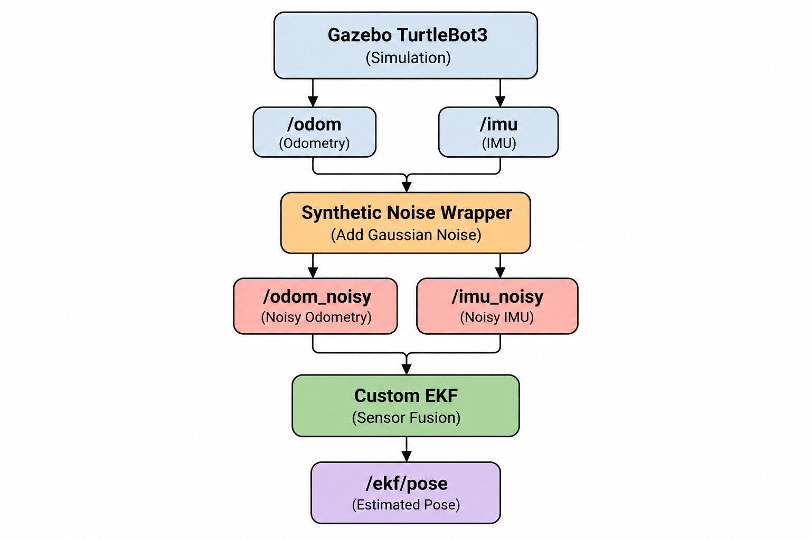

# ROS 2 EKF - Localization

- Built a complete localization pipeline from **Gazebo simulation → synthetic sensor noise → EKF sensor fusion → ROS 2 pose estimation → quantitative evaluation**.
- Implemented an **Extended Kalman Filter (EKF) from scratch** for 2D TurtleBot3 localization using **ROS 2 and Gazebo**.

## Implementation

  

- Simulated a **TurtleBot3 Burger in Gazebo** and drove it around the environment using ROS 2.
- Used the simulation's `/odom` and `/imu` topics as the original odometry and IMU measurements.
- Developed a **synthetic noise wrapper** that adds Gaussian noise to `/odom` and `/imu` and publishes the corrupted measurements as `/odom_noisy` and `/imu_noisy`.
- Implemented the EKF with the state `[x, y, θ]`, representing the robot's **2D position and heading**.
- Used the robot's **linear and angular velocity** with a nonlinear velocity motion model for the EKF prediction step.
- Fused noisy odometry position `(x, y)` with **IMU yaw `θ`** in the correction step.
- Published the final EKF state estimate to `/ekf/pose`.
- Passed the same noisy sensor measurements through ROS 2 **`robot_localization`** to compare its performance with my implementation.

## Project Flow

  

## Results

- Recorded the trajectories using **ROS bags** and evaluated localization error using **Absolute Pose Error (APE)** with `evo`.
- Reduced translational RMSE from **0.1412 m to 0.0903 m**, approximately a **36% reduction in error** compared with the noisy odometry input.
- Compared the custom EKF against **`robot_localization`**, which achieved an RMSE of **0.0669 m**.

<table align="center">
  <tr>
    <th>Method</th>
    <th>Translation RMSE</th>
  </tr>
  <tr>
    <td>Noisy Odometry</td>
    <td>0.1412 m</td>
  </tr>
  <tr>
    <td><b>Custom EKF</b></td>
    <td><b>0.0903 m</b></td>
  </tr>
  <tr>
    <td>robot_localization</td>
    <td>0.0669 m</td>
  </tr>
</table>

### Trajectory Comparison

  

<table align="center">
  <tr>
    <td><b>Black:</b> Reference Odometry</td>
    <td><b>Green:</b> Noisy Odometry</td>
    <td><b>Red:</b> Custom EKF</td>
    <td><b>Yellow:</b> robot_localization</td>
  </tr>
</table>

- The **noisy odometry** moves noticeably away from the reference trajectory, particularly around turns.
- The **custom EKF** removes much of this variation and keeps the estimated path closer to the reference.
- **`robot_localization`** produced the lowest overall translational error and provided a useful baseline for validating my implementation.

### Position Comparison

  

- The noisy `x` and `y` measurements fluctuate around the reference position throughout the run.
- The **custom EKF** produces smoother position estimates and follows the reference position more closely.

### Orientation Comparison

  

- Since the EKF estimates **2D planar motion**, yaw `θ` is the orientation component used for localization.
- The filtered estimate follows the robot's heading while reducing the noise introduced into the IMU measurements.
